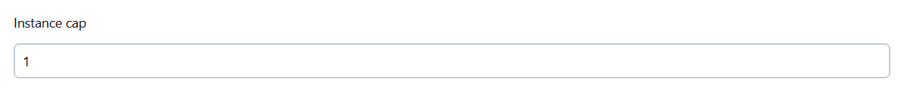
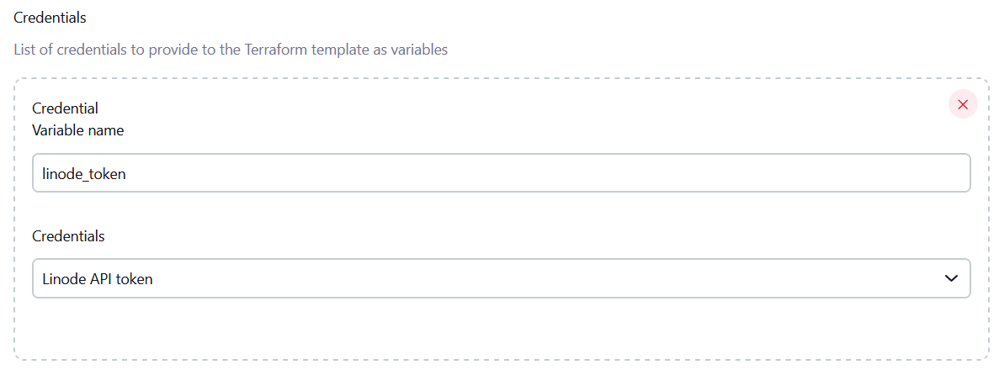

# Running builds on Linode with Sysbox and a cache volume

## Requirements

- [A Linode Block Storage Volume](https://www.linode.com/docs/products/storage/block-storage/)
  to be used as a cache 
- [A Linode image snapshot](https://www.linode.com/docs/products/tools/images/)
  with Docker and Sysbox already installed and working, with sysbox set as the default docker runtime. 
  Generating an image like this is a bit tricky as the last released binary of sysbox (0.5.2 as of writing this) 
  has [issues](https://github.com/nestybox/sysbox/issues/610)  on Linode (should be fixed on 0.6, 
  if it's ever released), so it needs to be manually compiled. 
  What worked for me was Ubuntu 20.04 with generic Kernel 5.4 (Linode's provided 6.0 seems to be having
  issues) and shiftfs manually compiled. 
- [Linode API token](https://www.linode.com/docs/products/tools/api/get-started/#get-an-access-token)
  with scopes:
  - images/read_only to be able to use the sysbox image we created
  - volumes/read_only to be able to attach the volume we want to use as cache
  - linodes/read_write to be able to created and destroy linodes
  - stackscripts/read_write as we are gonna use them for startup scripts when a new linode is spinned up
  - events/read_only as it's used by the Terraform linode provider to determine when the instance is 
    provisioned/booted/etc

Because of the use of a volume, (sadly) we need to set the instance cap to 1:


## Credentials


## Terraform file

After provisioning the Linode, we will run the jenkins inbound agent using Docker out of Docker, so that
we can easily use the latest image (for ease of upgrades) but at the same time have access to the whole machine.
The agent will spawn sysbox system containers as required by the controller.

```terraform
// Variables provided by the jenkins plugin
variable "jenkins_url" {}
variable "jenkins_websocket" {}
variable "jenkins_agent_name" {}
variable "jenkins_agent_secret" {}
variable "jenkins_agent_workdir" {}

// Credentials variables provided by the jenkins plugin
variable "linode_token" {}

resource "random_string" "root_pwd" {
  length  = 32
  special = true
}

terraform {
  required_providers {
    linode = {
      source  = "linode/linode"
      version = "1.30.0"
    }
  }
}

provider "linode" {
  token = var.linode_token
}

resource "linode_instance" "jenkins-agent" {
  label  = var.jenkins_agent_name
  group  = "jenkins"
  // Region and type can be selected from these: 
  // https://gist.github.com/displague/3c1728fdf4ff2bacf6960a9b8c6ea73f
  // The region needs to be on the same region as the volume to be able to mount it
  region = "us-southeast"
  type   = "g6-dedicated-2"
}

resource "linode_instance_config" "jenkins-agent-config" {
  linode_id = linode_instance.jenkins-agent.id
  label     = "sysbox-compatible-config"
  // Boot into the kernel provided by the OS, so that sysbox is properly supported (so with shiftfs working, etc)
  kernel    = "linode/grub2"

  devices {
    sda {
      disk_id = linode_instance_disk.boot.id
    }
    sdb {
      disk_id = linode_instance_disk.swap.id
    }
    sdc {
      // Can be obtained by going to volumes and inspecting network requests on your favorite browser
      volume_id = "864650"
    }
  }

  booted = true
}

resource "linode_instance_disk" "boot" {
  label     = "boot"
  linode_id = linode_instance.jenkins-agent.id
  size      = linode_instance.jenkins-agent.specs.0.disk - 512

  // Can be obtained by going on the image -> "Deploy to New Linode", then looking at the url 
  // (https://www.linode.com/community/questions/23572/linode-image-id-without-using-the-api)
  image     = "private/18903643"
  root_pass = random_string.root_pwd.result

  stackscript_id   = linode_stackscript.jenkins-agent.id
  stackscript_data = {
    "jenkins_url"           = var.jenkins_url
    "jenkins_websocket"     = var.jenkins_websocket
    "jenkins_agent_name"    = var.jenkins_agent_name
    "jenkins_agent_secret"  = var.jenkins_agent_secret
    "jenkins_agent_workdir" = var.jenkins_agent_workdir
    // Can be obtained by going on the volume -> "Show config", then looking at the first
    // argument of the mount command
    "ln_volume_fs_path" = "/dev/disk/by-id/scsi-0Linode_Volume_jenkins-cache"
  }
}

resource "linode_instance_disk" "swap" {
  label      = "swap"
  linode_id  = linode_instance.jenkins-agent.id
  size       = 512
  filesystem = "swap"
}

resource "linode_stackscript" "jenkins-agent" {
  label       = var.jenkins_agent_name
  description = "Runs jenkins inbound agent"
  script      = <<EOF
#!/bin/bash
# <UDF name="jenkins_url" Label="Jenkins controller URL to connect to" />
# <UDF name="jenkins_websocket" Label="Connect to Jenkins controller using websockets" />
# <UDF name="jenkins_agent_name" Label="Jenkins agent name" />
# <UDF name="jenkins_agent_secret" Label="Jenkins agent secret" />
# <UDF name="jenkins_agent_workdir" Label="Jenkins agent workdir" />
# <UDF name="ln_volume_fs_path" Label="Linode volume filesystem path" />
exec >/root/SSout 2>/root/SSerr
docker build -t podcrash/jenkins-inbound-agent-dood -f - . <<STOP
  FROM jenkins/inbound-agent:latest

  USER root
  RUN apt-get update && apt-get install --no-install-recommends -y \
      apt-transport-https \
      ca-certificates \
      curl \
      gnupg2 \
      software-properties-common
  RUN mkdir -m 0755 -p /etc/apt/keyrings
  RUN curl -fsSL https://download.docker.com/linux/debian/gpg | gpg --dearmor -o /etc/apt/keyrings/docker.gpg
  RUN echo \
      "deb [arch=$(dpkg --print-architecture) signed-by=/etc/apt/keyrings/docker.gpg] https://download.docker.com/linux/debian \
      \$(lsb_release -cs) stable" | tee /etc/apt/sources.list.d/docker.list > /dev/null
  RUN apt-get update && apt-get install --no-install-recommends -y \
      docker-ce docker-ce-cli containerd.io

  ENTRYPOINT ["/usr/local/bin/jenkins-agent"]
STOP

mkdir "/mnt/jenkins-cache"
mount $LN_VOLUME_FS_PATH "/mnt/jenkins-cache"
docker run --runtime=runc --init -d \
    -v /var/run/docker.sock:/var/run/docker.sock \
    -v "/mnt/jenkins-cache/jenkins-agent/:$JENKINS_AGENT_WORKDIR" \
    -e=JENKINS_WEB_SOCKET=$JENKINS_WEBSOCKET \
    podcrash/jenkins-inbound-agent-dood \
    -workDir "$JENKINS_AGENT_WORKDIR" \
    -url $JENKINS_URL \
    $JENKINS_AGENT_SECRET $JENKINS_AGENT_NAME
EOF
  images      = ["any/all"]
  is_public   = "false"
}
```